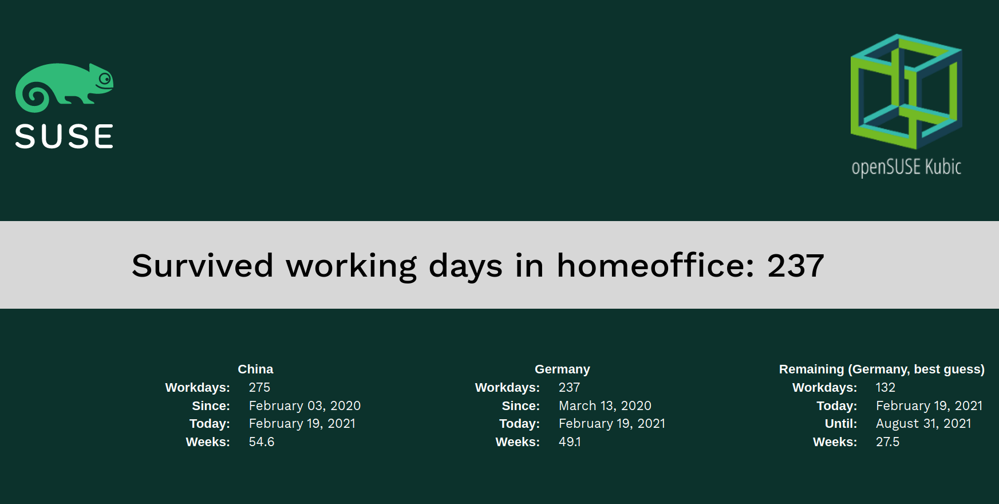

# workday-counter
workday-counter POD

This POD consist of a container image which can be deployed on a
Kubernetes cluster and accessed via a load balancer. It displays:
  * The SUSE and openSUSE MicroOS logos
  * A message with the number of working days
  * Start and end date

The default port is 8080 and can be changed in the service section of the yaml
file. 

To deploy: ``kubectl apply -f https://raw.githubusercontent.com/thkukuk/workday-counter/master/yaml/workday-counter.yaml``

The image is available from registry.opensuse.org: 
`registry.opensuse.org/home/kukuk/container/container/workday-counter:latest`
